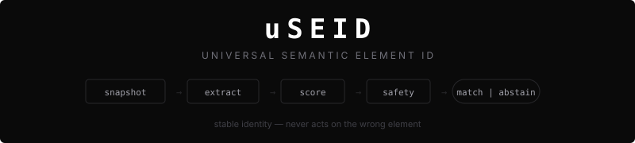

<p align="center">
  
</p>

<p align="center">
  <a href="https://www.npmjs.com/package/@pyyush/useid"></a>
  <a href="https://github.com/pyyush/useid/actions/workflows/ci.yml"></a>
  <a href="LICENSE"></a>
  
</p>

**uSEID is the grounding gate for browser agents: resolve when the target is justified, abstain when it is not.**

Browser agents and E2E tests fail when the UI changes. A developer renames a CSS class, wraps a button in a new `<div>`, or ships an A/B variant — and suddenly your carefully crafted selectors target the wrong element. Or nothing at all.

uSEID solves the grounding problem by identifying elements from portable snapshot evidence: what they *are* (role + accessible name), where they *sit* (structural context), and where they *appear* (spatial context). When supported signals still point strongly to the same element, uSEID can resolve it. When the evidence is weak, conflicting, or out of scope, it abstains clearly instead of nudging a browser agent toward the wrong target.

uSEID is intentionally narrow:

- **It is:** a portable element identity and safe-resolution layer.
- **It is not:** a browser automation runtime, replay engine, or generic agent framework.

## How It Works

```
                     Build                              Resolve
                     ─────                              ───────
Snapshots ──→ Canonicalize ──→ Extract ──→ Signature    Signature + New Snapshots
 (DOM + A11y)   (normalize)    (features)   (portable)      ↓
                                                        Candidates → Score → Safety Gate
                                                                              ↓
                                                                    Match (with confidence)
                                                                    or Abstain (with reason)
```

uSEID builds a **portable signature** from three signals:

| Signal | What it captures | Why it's stable |
|--------|-----------------|-----------------|
| **Semantic** | ARIA role + accessible name | Standardized by W3C, rarely changes |
| **Structural** | Ancestor roles, sibling labels, form associations | Survives wrapper changes |
| **Spatial** | Bounding box position | Catches layout-only changes |

The signature hash is a **capture fingerprint**, not a promise of permanent identity. It includes binding and structural context so duplicate same-name elements on one page do not collapse into the same fingerprint.

## Install

```bash
npm install @pyyush/useid
```

Zero config. One dependency (zod). The `1.0.0-rc.1` package is tested and supported on Node.js 20 and 22, matching CI and release verification.

## Release Status

The npm `latest` dist-tag is verified as `0.1.0` and the npm `rc` dist-tag is verified as `1.0.0-rc.1` as of May 5, 2026. Install the release candidate with `npm install @pyyush/useid@rc`. The examples below describe the `1.0.0-rc.1` API and intended stable contract unless the changelog says otherwise.

For a first working check in under five minutes with the RC: capture one DOM snapshot plus one accessibility snapshot from your browser tool, choose the intended element from `extractElements()`, call `buildUSEID()`, then call `resolveUSEID()` before taking the browser action.

## Migration Notes For The 1.0.0 RC

If you are moving from the published `0.1.0` package toward the `1.0.0-rc.1` contract:

- Branch on `result.resolved` before reading success or failure fields.
- Handle all stable abstention reasons: `binding_mismatch`, `no_candidates`, `below_threshold`, and `ambiguous_match`.
- Keep custom scoring weights normalized. `semantic + structural + spatial` must equal `1`.
- Expect stricter abstention for duplicate same-role targets, missing accessible-name evidence, role drift, incomplete layout evidence, and DOM/accessibility mismatches.
- Treat redacted signatures as log/support artifacts only. They are intentionally not usable for later resolution.
- Keep browser-harness adoption at the snapshot boundary unless a separate integration project explicitly adds a bridge.

## Quick Start

```typescript
import { buildUSEID, extractElements, resolveUSEID } from "@pyyush/useid";

// Capture snapshots from your browser automation tool
const domSnapshot = {
  snapshot: await cdpSession.send("DOMSnapshot.captureSnapshot", {
    computedStyles: ["display", "visibility", "opacity", "position"],
    includeDOMRects: true,
  }),
};
const a11ySnapshot = {
  tree: await page.accessibility.snapshot({ interestingOnly: false }),
};

// Build a signature for the "Add to Cart" button
const elements = extractElements(domSnapshot, a11ySnapshot);
const elementIndex = elements.findIndex(
  (element) =>
    element.role === "button" &&
    element.accessibleName.toLowerCase() === "add to cart"
);

if (elementIndex === -1) {
  throw new Error("Could not find the Add to Cart button in the captured snapshots");
}

const signature = buildUSEID({
  domSnapshot,
  accessibilitySnapshot: a11ySnapshot,
  elementIndex,
  pageUrl: "https://shop.example.com/product/42",
});

// Store the signature. Ship it. Come back next week.

// Resolve it against fresh snapshots — even after a redesign
const result = resolveUSEID({
  signature,
  domSnapshot: freshDomSnapshot,
  accessibilitySnapshot: freshA11ySnapshot,
  pageUrl: "https://shop.example.com/product/42",
});

if (result.resolved) {
  console.log(result.selectorHint);  // role=button[name="add to cart"]
  console.log(result.confidence);    // 0.94
  console.log(result.scores);        // { semantic, structural, spatial }
} else {
  console.log(result.abstentionReason);  // "below_threshold"
  console.log(result.explanation);       // human-readable why
}
```

## Grounding Gate Pattern

uSEID is meant to sit in front of an execution layer:

```typescript
const result = resolveUSEID({ signature, domSnapshot, accessibilitySnapshot, pageUrl });

if (!result.resolved) {
  // Stop the action. Ask for human review, refresh the capture, or fall back
  // to a safer recovery path in your own system.
  throw new Error(`uSEID abstained: ${result.abstentionReason} - ${result.explanation}`);
}

// Only act after the grounding gate resolves.
await executor.click(result.selectorHint);
```

That contract is the point of the library: **wrong element is worse than no element.**

See `examples/grounding-gate.ts` for a repo-local copy/adapt example of the same pattern. It is documentation, not a published package entrypoint.

## Safety: Wrong Element Is Worse Than No Element

Most selector strategies fail silently — they click *something*, just not the right thing. uSEID's safety gate ensures that doesn't happen:

| When this happens... | uSEID does this | Why |
|---------------------|----------------|-----|
| Page URL doesn't match signature | Abstains (`binding_mismatch`) | Prevents cross-page false matches |
| No elements share the expected role | Abstains (`no_candidates`) | Avoids widening to unrelated element types |
| Best match scores below 0.85 | Abstains (`below_threshold`) | Not confident enough |
| Two candidates score too close | Abstains (`ambiguous_match`) | Near-ties are still unsafe |

Every abstention comes with an `explanation` string and a ranked `candidates` list with per-signal scoring context so you can debug or escalate to a human. Successful resolutions also return per-signal `scores` and an optional `scoreGap` to show how clearly the winner separated from the runner-up.

## Observability And Debugging

For production traces, log stable, low-risk fields first:

- `resolved`
- `abstentionReason` when unresolved
- `confidence`, `scores`, and `scoreGap` when resolved
- configured `threshold`, `marginConstraint`, and `weights`
- signature `hash`, page origin/path, and frame depth
- candidate count and top candidate score bands, not raw candidate names by default

`scoreGap` is present on resolved results when there is a runner-up candidate; if it is absent, only one same-role candidate reached the safety gate. Track missing gaps separately from small gaps.

The stable abstention reasons are `binding_mismatch`, `no_candidates`, `below_threshold`, and `ambiguous_match`. Treat these as metric dimensions and alert on changes in abstention rate rather than forcing a fallback action.

Use `explainResolution(result)` for local debugging or redacted support bundles. The explanation and unresolved `candidates` list can contain accessible names from the page, so avoid shipping raw explanations into long-retention logs unless your product policy allows that data.

For production logs, do not call `explainResolution(result)` on raw unresolved results by default. Prefer a redacted shape with `abstentionReason`, candidate count, score bands, and a generic explanation. If you need a support bundle, redact candidate `accessibleName`, `selectorHint`, and any top-level explanation text first; `examples/grounding-gate.ts` shows that pattern.

## Configurable Scoring

The defaults work well for most cases. When they don't, everything is tunable:

```typescript
resolveUSEID({
  signature,
  domSnapshot,
  accessibilitySnapshot: a11ySnapshot,
  pageUrl: "https://example.com/page",
  config: {
    threshold: 0.9,          // Stricter (default: 0.85)
    marginConstraint: 0.15,  // Wider gap required (default: 0.1)
    weights: {
      semantic: 0.7,         // Trust names more (default: 0.5)
      structural: 0.2,       // Trust DOM context less (default: 0.3)
      spatial: 0.1,          // Trust position less (default: 0.2)
    },
  },
});
```

## Security And Privacy

Element signatures are derived from page snapshots. That means raw signatures, explanations, and candidate diagnostics can include user-visible text, accessible names, accessible descriptions, sibling labels, and form labels. Treat them as potentially sensitive application data.

For logging or storage:

```typescript
import { redactUSEID } from "@pyyush/useid";

const safe = redactUSEID(signature);
// accessible names → hashed, sibling tokens → stripped, form labels → removed
// Safe to log. NOT resolvable after redaction (by design).
```

Guidance:

- Store raw signatures only where you would store the underlying page text.
- Prefer redacted signatures in logs, analytics, support bundles, and test artifacts.
- Do not expect `redactUSEID()` output to resolve later; redaction intentionally removes grounding signal.
- Candidate diagnostics are useful for debugging but can expose nearby labels. Log counts, reasons, scores, and redacted explanations by default.
- Avoid sending raw snapshots, signatures, or candidate lists to model prompts or external observability tools unless your data-handling policy permits it.

## Bring Your Own Automation

uSEID is framework-agnostic. It accepts two minimal interfaces:

```typescript
interface DOMSnapshotResult {
  snapshot: unknown;  // CDP DOMSnapshot.captureSnapshot response
}

interface AccessibilitySnapshotResult {
  tree: unknown;  // Playwright, Puppeteer, or any a11y tree
}
```

No Playwright dependency. No CDP dependency. If your tool can produce a DOM tree and an accessibility tree, uSEID works with it.

## Snapshot Boundary

To drive uSEID from a browser harness or any CDP-capable host, capture the boundary data outside uSEID and pass it in:

| Boundary input | Required shape | Notes |
|----------------|----------------|-------|
| Page URL | Current page URL string | Must match signature origin and path. |
| DOM snapshot | `DOMSnapshot.captureSnapshot` response | Use `includeDOMRects: true`; layout bounds improve spatial confidence. |
| Accessibility snapshot | Accessibility tree with roles and names | Use a full tree when possible, such as Playwright `interestingOnly: false`. |
| Frame path | `FramePathEntry[]` for iframe targets | Required when the signature was built inside a frame. |

Spatial scoring currently normalizes layout distance against a fixed `1024x768` viewport model. Keep viewport sizes stable across captures when spatial evidence matters, and treat spatial score as disambiguation evidence rather than a browser-viewport support claim.

Strong-fit cases have the same binding, same role, stable accessible name, enough structural context, usable layout evidence, and a score gap above the margin. Abstain cases include binding mismatch, missing same-role candidates, weak evidence below threshold, near-tied duplicates, DOM/a11y mismatch, closed shadow DOM without internal layout evidence, and cross-origin frames unless the caller can provide separately bound snapshots.

## Browser-Harness Learn-From Interop

Decision: `learn-from`. uSEID does not add a browser-harness dependency, backend, runtime bridge, or required browser runtime. A formal bridge would change scope and needs human confirmation before implementation.

Use this mapping when a browser-harness-style agent wants safe grounding:

| Browser-harness step | uSEID-safe step |
|----------------------|-----------------|
| Observe page/frame | Capture DOM + accessibility snapshots and current page URL. |
| Select target | Build or load a `USEIDSignature` for the intended element. |
| Before click/fill/hover | Call `resolveUSEID()` with fresh snapshots and frame path. |
| Resolved | Execute the harness action against `selectorHint` and record confidence/score gap. |
| Abstained | Do not act. Record the abstention reason, refresh capture, ask for review, or choose a product-specific safe recovery path. |

See `examples/grounding-gate.ts` for a browser-harness-facing example that resolves a target only after the uSEID confidence and abstention gate passes.

## What Works Today (`1.0.0-rc.1`)

| | Supported | Behavior |
|-|-----------|----------|
| Node.js runtime | 20 and 22 | Tested CI/release matrix; package engines intentionally do not claim Node 24+ until extraction budget evidence is added |
| Chromium | Yes | Full CDP snapshot support |
| Main frame | Yes | Default |
| Same-origin iframes | Yes | When the caller captures the iframe snapshots and passes the correct `framePath` |
| Cross-origin iframes | No | Out of scope unless the caller can provide separate bound snapshots |
| Open shadow DOM | Yes | Flattened by CDP DOMSnapshot |
| Closed shadow DOM | No | Abstains when internal name/layout evidence is unavailable |

## Support Limits And Honest Abstention Cases

Expect abstentions, not heroics, when:

- the expected role is gone from the page
- two candidates remain near-tied after scoring
- accessible names are missing or unstable
- the caller provides incomplete or mismatched frame bindings
- DOM and accessibility snapshots disagree too much to ground safely
- the host surface falls outside the current Chromium + CDP snapshot model
- the runtime falls outside the Node 20/22 tested support matrix for this RC

## Full API

| Function | Purpose |
|----------|---------|
| `buildUSEID(opts)` | Build a portable signature from snapshots |
| `resolveUSEID(opts)` | Resolve a signature against current snapshots |
| `compareUSEID(a, b)` | Compare two signatures conservatively (0, 0.5, or 1) |
| `explainResolution(result)` | Human-readable explanation |
| `redactUSEID(signature)` | Strip PII for safe logging |

Lower-level functions are also exported for custom pipelines: `extractElements`, `generateCandidates`, `scoreCandidates`, `applySafetyGate`, `checkBinding`.

## License

Apache-2.0
